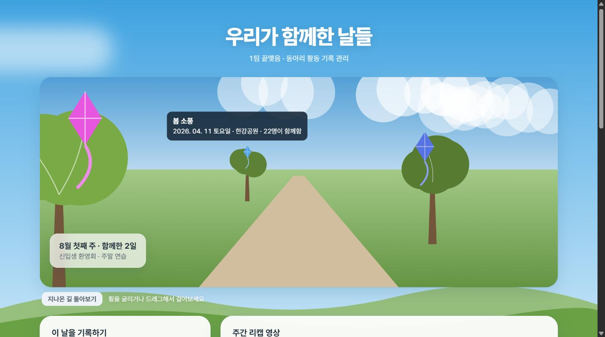
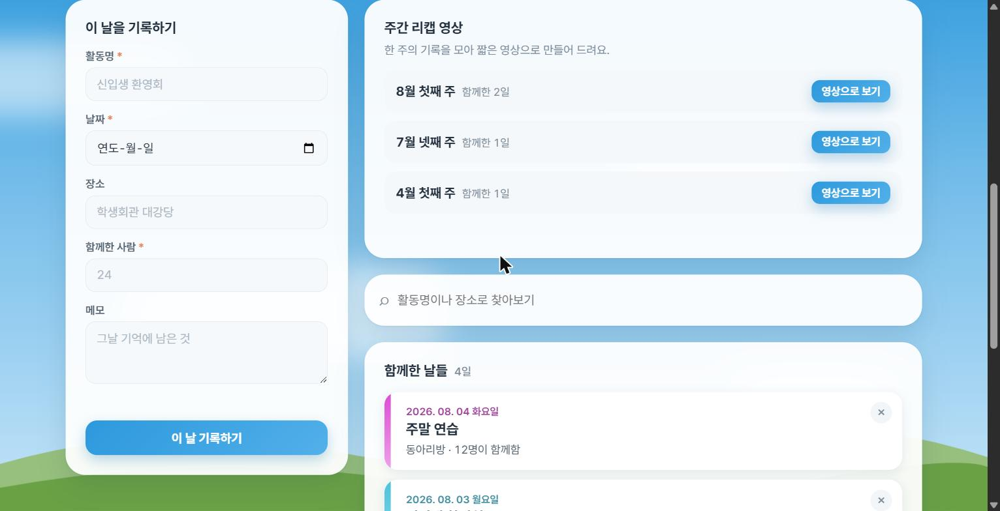
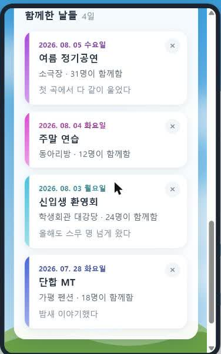
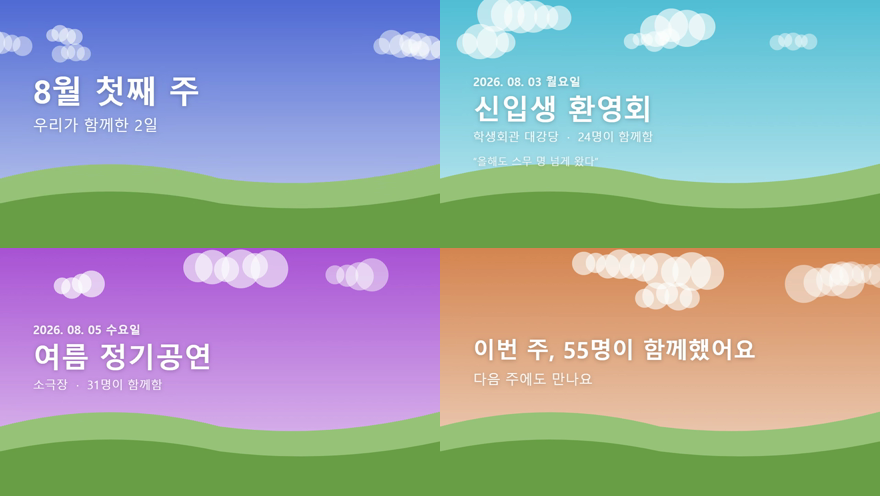

# 함께한 날들

동아리 활동 기록 관리 웹앱 · 2026-08-05 해커톤 제출물

동아리 임원이 활동 내역을 남기고 다시 꺼내 보는 웹앱입니다.
행정 기록물이 아니라 **나중에 다시 보며 즐거운 것**을 목표로 만들었습니다.

그래서 기록을 **걸어서 돌아보는 길**로 만들었습니다.

```
길        = 시간. 걸어갈수록 과거로 간다
나무      = 한 주. 오래된 주일수록 크게 자라 있다
나무 사이 거리 = 실제 공백. 뜸했던 기간은 나무 없는 긴 길이 된다
연        = 그 주의 활동 한 건. 나무 위 하늘에 떠 있다
기록하는 순간 = 연이 되어 하늘로 날아오른다
```



시간이 지나면 가만히 둬도 나무가 자랍니다. 다시 들어와 볼 이유가 생기는 것이 이 은유의 핵심입니다.



## 팀

|           |                            |
| --------- | -------------------------- |
| 팀번호 / 팀이름 | 1팀 / 끝맺음                   |
| 팀원        | 이봉운 (1인 팀)                 |
| 역할        | 기획 · 설계 · 구현 · 테스트 · 문서 전담 |

## 구현한 기능

### 필수 기능

| 기능       | 설명                                    |
| -------- | ------------------------------------- |
| 활동 등록    | 활동명, 날짜, 장소, 참여 인원, 메모를 입력해 저장합니다     |
| 활동 목록 조회 | 최신순 타임라인으로 보여줍니다. 기록이 없으면 안내 문구가 나옵니다 |
| 활동 삭제    | 카드 안에서 한 번 더 확인한 뒤 삭제합니다              |

### 입력값 검증

| 항목    | 규칙               | 안내 문구                     |
| ----- | ---------------- | ------------------------- |
| 활동명   | 공백만 있으면 안 됩니다    | `활동명을 입력해 주세요.`           |
| 날짜    | 미래 날짜를 넣을 수 없습니다 | `미래 날짜는 입력할 수 없습니다.`      |
| 참여 인원 | 1 이상의 정수여야 합니다   | `참여 인원은 1명 이상의 정수여야 합니다.` |

날짜 입력란은 `max` 속성으로 미래 날짜를 미리 막고, 저장할 때 한 번 더 검사합니다.

### 선택 기능

**1. 활동명·장소 키워드 검색**

입력하는 즉시 걸러집니다. 기록이 아예 없을 때(`아직 기록된 날이 없어요.`)와 검색 결과가 없을 때(`그런 날은 아직 없네요.`)의 안내를 구분했습니다.

**2. 반응형 레이아웃**

768px 미만에서 1단으로 쌓입니다. 375px 폭에서도 가로 스크롤이 생기지 않습니다.



**3. 주간 리캡 영상 — 이 앱의 핵심**

한 주의 기록을 모아 영상 파일(`.webm`) 한 편으로 만들어 내려받습니다.

```
활동 1건 ──> 하늘 한 장 ─┐
활동 1건 ──> 하늘 한 장 ─┼─> 주차별 묶음 ─> canvas 애니메이션
활동 1건 ──> 하늘 한 장 ─┘                        │
                            canvas.captureStream(30fps)
                                                  │
                                MediaRecorder ─> Blob ─> 다운로드
                                                  │
                                    recap-2026-W32.webm
```

- 표지 3초 → 활동당 4초 → 마무리 3초. 활동 수에 따라 길이가 정해집니다
- **활동명을 해시해 하늘 색을 정합니다.** 같은 활동은 언제 봐도 같은 하늘이고, 활동마다 다른 하늘이 됩니다
- 하늘 색조는 맑은 하늘 · 늦은 오후 · 노을 대역 안에서만 움직입니다. 언덕은 항상 초록이라 하늘과 구분됩니다
- 화면의 타임라인 카드 왼쪽 색 띠가 그 활동의 하늘색입니다. 화면에서 본 색이 영상에 그대로 나옵니다



*실제로 생성된 영상에서 뽑은 프레임입니다 (13초, 1280×720, VP8).*

**4. 기억의 산책길 — 몰입형 회상**

기록을 목록이 아니라 **걸어서 지나가는 길**로 봅니다. 위 은유 그대로 canvas 2D로 그렸습니다.

| 조작 | 결과 |
|---|---|
| 휠 · 드래그 · 방향키 | 길을 앞뒤로 걸어간다 |
| 나무에 가까워짐 | 그 주의 기록이 화면에 뜬다 |
| 연에 마우스 올리기 | 그 활동의 날짜·장소·인원이 쪽지로 뜬다 |
| 연 클릭 | 아래 타임라인의 그 기록으로 내려가 강조된다 |
| 나무 클릭 | 아래 그 주의 리캡 영상 버튼으로 내려가 강조된다 |
| 지나온 길 돌아보기 | 카메라가 180도 돌아 반대 방향을 본다 |

핵심 계산은 원근 투영 하나입니다.

```js
// facing: 1 = 과거 쪽을 봄, -1 = 지나온 쪽을 봄
const depth = facing * (z - cameraZ) + THEME.walk.near;
const scale = THEME.walk.focal / depth;
```

나무 크기는 경과일에서 나옵니다.

```js
const daysAgo = (Date.now() - monday.getTime()) / 86400000;
return 1 + Math.min(daysAgo / 365, 2);   // 1년에 걸쳐 최대 3배
```

## 실행 방법

설치할 것도 실행할 서버도 없습니다.

```bash
git clone https://github.com/bongbong06/hackathon-1-kkeutmaejeum.git
cd hackathon-1-kkeutmaejeum
```

그 다음 `index.html` 을 브라우저로 열면 됩니다. (더블클릭해도 됩니다)

로컬 서버로 열고 싶다면:

```bash
python -m http.server 8000
# http://127.0.0.1:8000 접속
```

**권장 브라우저: Chrome / Edge.** 리캡 영상 기능은 `MediaRecorder` API를 씁니다. 이를 지원하지 않는 브라우저에서는 영상 저장 대신 미리보기만 보여주고, 나머지 기능은 그대로 동작합니다.

## 기술 스택

|          |                                                        |
| -------- | ------------------------------------------------------ |
| 프론트엔드    | HTML / CSS / JavaScript (프레임워크 없음)                     |
| 데이터 저장   | 브라우저 localStorage                                      |
| 영상 생성    | canvas 2D · `canvas.captureStream()` · `MediaRecorder` |
| 외부 라이브러리 | **없음** (JS 라이브러리 0개)                              |
| 웹폰트 | Pretendard (CDN). 받지 못하면 `system-ui` 로 폴백되며 레이아웃은 그대로 유지됩니다 |

## 이미지·영상 제공자 교체

리캡의 활동 이미지와 영상 생성은 `app.js` 위쪽의 provider 두 줄로 교체할 수 있습니다. 기본값은 기존 동작과 같은 canvas 하늘과 브라우저 `MediaRecorder`입니다.

```js
const imageProvider = imageProviders.canvas;   // canvas | local | api
const videoProvider = videoProviders.browser;  // browser | api
```

### 활동 이미지 provider

`imageFor(activity)`는 활동 객체를 받고 `data:` 이미지 URL 또는 `null`을 반환하는 비동기 함수입니다. `null`이거나 이미지 생성·로딩에 실패하면 기존 `drawScene()` 하늘로 조용히 대체되어 리캡 영상은 계속 만들어집니다.

- `imageProviders.canvas`: 항상 `null`을 반환하는 기본값
- `imageProviders.local`: `http://127.0.0.1:7860/sdapi/v1/txt2img`로 활동 내용과 1280×720 출력 설정을 보내는 Stable Diffusion WebUI(A1111) 참고 구현
- `imageProviders.api`: `https://api.example.com/v1/activity-images`로 활동 객체와 출력 설정을 보내는 외부 API 참고 구현

> **이미지는 반드시 `data:` URL이어야 합니다.** 일반 `https://` 이미지를 canvas에 직접 그리면 canvas가 오염(tainted)되어 `captureStream()`이 `SecurityError`로 막힐 수 있습니다. 외부 API가 URL만 반환한다면 provider 안에서 `fetch` → `blob` → `FileReader.readAsDataURL` 순서로 변환해야 하며, 이미지 서버도 CORS를 허용해야 합니다.

이미지는 녹화를 시작하기 전에 활동별로 미리 받아 `activity.id` 기준으로 캐시합니다. 녹화 프레임에서는 네트워크를 호출하지 않고 준비된 이미지만 cover 방식으로 그린 뒤, 활동의 하늘색과 아래쪽 어두운 그라데이션을 덮어 기존 글자 구성을 유지합니다.

### 영상 provider

`render(week, onProgress)`는 주차 객체를 받고 진행 상황을 `onProgress({ progress, secondsLeft })`로 알린 뒤 완성된 WebM `Blob`을 반환하는 비동기 함수입니다.

- `videoProviders.browser`: `canvas.captureStream()`과 `MediaRecorder`로 실시간 녹화하는 기본값. 백그라운드 탭에서도 영상이 잘리지 않도록 그리기 루프는 `setInterval`을 유지합니다
- `videoProviders.api`: `https://api.example.com/v1/weekly-recaps`로 주차·활동·출력 설정을 보내고 WebM 바이너리를 받는 외부 API 참고 구현

provider는 교체 지점일 뿐 기본 설정에서는 어떤 로컬 서버나 외부 API도 호출하지 않습니다.

## 파일 구조

```
index.html                화면 구조
style.css                 스타일 (맨 위 :root 에 디자인 토큰을 모아 둠)
app.js                    전체 로직
CLAUDE.md                 Claude Code 작업 규칙
docs/screenshots/         실행 화면
docs/prompt-log.md        Claude Code와 주고받은 기록
docs/superpowers/specs/   설계 문서
```

## 데이터 구조

`localStorage["activities"]` 가 유일한 진실 소스입니다. 화면은 항상 여기서 다시 그립니다.

```js
{
  id,           // 고유 식별자
  title,        // 활동명 (필수)
  date,         // "YYYY-MM-DD"
  place,        // 장소
  memberCount,  // 참여 인원 (1 이상 정수)
  memo,         // 메모
  createdAt     // 등록 시각 ISO 문자열
}
```

등록·삭제·검색 어디서 무엇이 바뀌든 `render()` 하나만 호출합니다. 타임라인과 주차 목록이 항상 같은 데이터를 보므로 화면이 서로 어긋날 수 없습니다.

## 설계에서 신경 쓴 것

**브라우저 모달을 쓰지 않았습니다.** 삭제 확인을 `confirm()` 대신 카드 안 인라인 UI로 만들었습니다. 모달은 페이지 스크립트를 멈춰 세워 자동 테스트를 불가능하게 만들고, 모바일에서 흐름도 끊깁니다.

**영상 그리기 루프에 `setInterval` 을 썼습니다.** 처음에는 `requestAnimationFrame` 을 썼는데, 탭이 뒤로 가면 아예 멈춰서 14초짜리 영상이 3초로 잘려 저장됐습니다. `setInterval` 은 느려질 뿐 계속 돌기 때문에 영상이 끝까지 만들어집니다.

**디자인을 바꾸기 쉽게 했습니다.** 색·모양·간격은 `style.css` 맨 위 `:root` 에, 영상 쪽 값은 `app.js` 맨 위 `THEME` 에 모아 두었습니다. 그 값만 고치면 전체가 따라 바뀝니다.

## 테스트 결과

실제 브라우저에서 아래 항목을 전부 확인했습니다.

| #   | 확인 항목         | 결과                        |
| --- | ------------- | ------------------------- |
| 1   | 빈 상태로 열기      | 통과 — `아직 기록된 날이 없어요.`     |
| 2   | 정상 입력 후 저장    | 통과 — 목록 추가, 폼 비워짐         |
| 3   | 새로고침          | 통과 — 기록 유지                |
| 4   | 활동명 비우고 저장    | 통과 — 차단 + 안내 문구           |
| 5   | 내일 날짜로 저장     | 통과 — 차단 + 안내 문구           |
| 6   | 인원 0 / 소수로 저장 | 통과 — 차단 + 안내 문구           |
| 7   | 여러 건 등록       | 통과 — 최신 날짜가 위             |
| 8   | 삭제 → 그대로 두기   | 통과 — 삭제되지 않음              |
| 9   | 삭제 → 지우기      | 통과 — 목록에서 사라짐             |
| 10  | 활동명 / 장소 검색   | 통과 — 해당 항목만 표시            |
| 11  | 없는 키워드 검색     | 통과 — `그런 날은 아직 없네요.`      |
| 12  | 창 폭 375px     | 통과 — 1단, 가로 스크롤 없음        |
| 13  | 주차 묶기         | 통과 — 8월 첫째 주 / 7월 넷째 주    |
| 14  | 리캡 영상 만들기     | 통과 — 진행률 표시 후 `.webm` 저장  |
| 15  | 받은 영상 재생      | 통과 — 13.0초, 1280×720, VP8 |
| 16 | 산책길 걷기 (휠·드래그·방향키) | 통과 — 앞뒤 이동, 범위 밖으로 안 나감 |
| 17 | 나무 크기 | 통과 — 4월 주 1.33배 vs 8월 주 1.01배 |
| 18 | 나무 배치 | 통과 — 공백 반영 (z 0 → 240 → 970) |
| 19 | 연 호버 | 통과 — 활동 정보 쪽지 표시 |
| 20 | 연 클릭 | 통과 — 해당 타임라인 카드로 이동·강조 |
| 21 | 나무 클릭 | 통과 — 해당 주차 행으로 이동·강조 |
| 22 | 돌아보기 | 통과 — 방향 반전, 버튼 문구 갱신 |
| 23 | 기록 등록 | 통과 — 연이 날아오르고 그 주 나무의 연이 1개 늘어남 |
| 24 | 산책길 모바일 375px | 통과 — 높이 260px, 가로 스크롤 없음 |

## 알려진 한계

- 데이터가 브라우저 localStorage에만 있어 다른 기기·브라우저에서는 보이지 않습니다
- 활동 수정 기능이 없습니다. 잘못 입력하면 지우고 다시 등록해야 합니다
- 리캡 영상의 이미지는 canvas로 그린 것이라 사진 같은 그림은 나오지 않습니다. 타이포그래피와 색, 도형으로 구성된 포스터 형태입니다
- 녹화가 실시간이라 영상 길이만큼 기다려야 합니다

## 개발 도구

Claude Code로 개발했습니다. 작업 규칙은 [`CLAUDE.md`](CLAUDE.md), 주고받은 기록은 [`docs/prompt-log.md`](docs/prompt-log.md) 에 있습니다.
