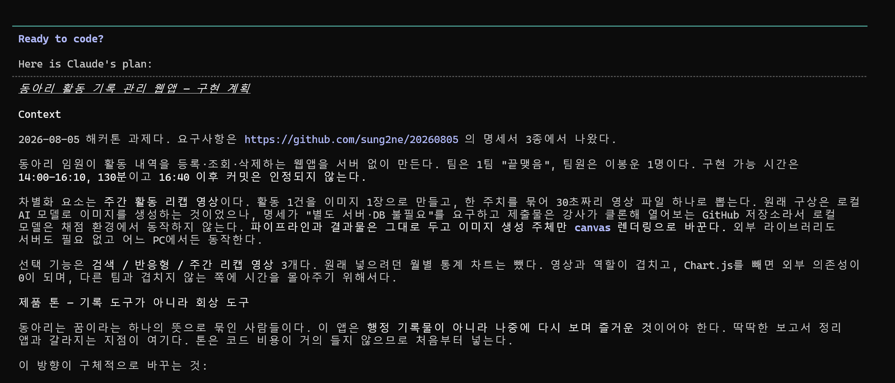
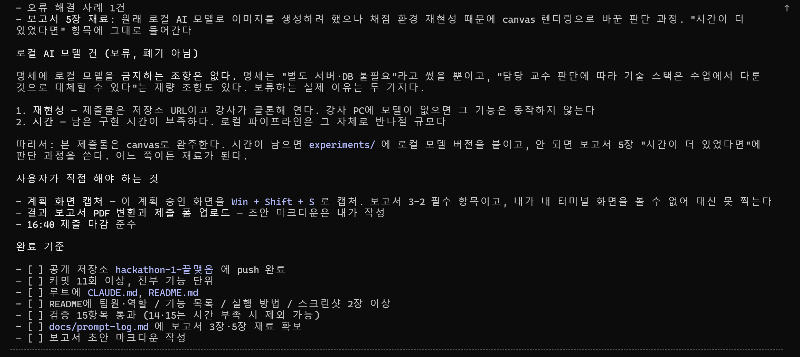

# 해커톤 결과 보고서

> 제출 전 확인할 것
> - [x] 3-2에 구현 전 계획 화면 캡처 첨부 완료 (12장, `docs/screenshots/plan/`)
> - [ ] 이 문서를 PDF로 변환 (2~4쪽)
> - [ ] 제출 폼에 저장소 URL + PDF 업로드

---

## 표지

| | |
|---|---|
| 팀번호 / 팀이름 | 1팀 / 끝맺음 |
| 팀원 및 역할 | 이봉운 — 기획 · 설계 · 구현 · 테스트 · 문서 전담 (1인 팀) |
| GitHub 저장소 URL | https://github.com/bongbong06/hackathon-1-kkeutmaejeum |
| 제출일 | 2026-08-05 |

---

## 1. 문제 정의와 기획

**이 웹앱이 해결하려는 문제**

동아리 활동 기록은 대개 "남겨야 하니까 남기는 것"으로 끝난다. 엑셀이나 문서에 날짜와 인원을 적어 두지만 아무도 다시 열어 보지 않는다. 동아리는 꿈이라는 하나의 뜻으로 묶인 사람들인데, 그 기록이 행정 서류로만 남는 것이 아깝다고 생각했다.

그래서 이 앱의 목표를 **"기록하기 편한 앱"이 아니라 "다시 볼 때 즐거운 앱"**으로 잡았다.

**주 사용자와 사용 상황**

동아리 임원. 활동이 끝난 날 저녁에 그날을 한 건 등록하고, 학기 말이나 신입생 모집 때 한 해를 돌아본다.

**구현한 필수 기능 3가지**

1. 활동 등록 — 활동명, 날짜, 장소, 참여 인원, 메모
2. 활동 목록 조회 — 최신순 타임라인, 기록이 없으면 안내 문구
3. 활동 삭제 — 카드 안 인라인 확인 후 삭제

**구현한 선택 기능과 선택한 이유**

| 선택 기능 | 왜 골랐나 |
|---|---|
| 활동명·장소 키워드 검색 | 기록이 쌓이면 찾는 일이 반드시 생긴다. 구현 비용 대비 효용이 가장 크다 |
| 반응형 레이아웃 | 활동 직후 휴대폰으로 바로 남기는 상황이 실제 사용 흐름에 가깝다 |
| 주간 리캡 영상 | 목록을 보여주는 것만으로는 "다시 볼 때 즐거운 것"이 되지 않았다 |
| **기억의 산책길** | 위 셋을 다 만들고도 화면이 정적이라 감흥이 없었다. 기록을 목록이 아니라 걸어서 지나가는 길로 바꿨다 |

원래 월별 통계 차트를 넣으려 했으나 뺐다. 다른 팀도 하는 기능이라 변별력이 없고, 리캡 영상과 역할이 겹치며, 차트를 빼면 외부 라이브러리가 0개가 되기 때문이다.

---

## 2. 설계

**화면 구성**

단일 페이지. 데스크톱은 좌우 2단, 768px 미만에서 1단으로 쌓인다.

```
+----------------------------------+
|        우리가 함께한 날들           |
+-------------+--------------------+
| 이 날 기록   |  주간 리캡 영상       |
| 활동명 *    |  8월 첫째 주 [영상]   |
| 날짜   *    |  7월 넷째 주 [영상]   |
| 장소        +--------------------+
| 인원   *    |  [검색어 입력]       |
| 메모        +--------------------+
| [이 날      |  함께한 날들  4일     |
|  기록하기]  |  | 여름 정기공연      |
|             |  | 2026.08.05  [x]  |
+-------------+--------------------+
   (배경: 하늘 · 구름 · 평원 언덕)
```

**비주얼 컨셉 — 활동 1건 = 하늘 한 장**

활동명을 해시해 색조(H)를 정한다. 같은 활동은 언제 봐도 같은 하늘이고, 활동마다 다른 하늘이 된다. 색조는 맑은 하늘 · 늦은 오후 · 노을 대역 안에서만 움직이고, 언덕은 항상 초록이라 하늘과 구분된다. 타임라인 카드 왼쪽 색 띠가 그 활동의 하늘색이어서, 화면에서 본 색이 영상에 그대로 나온다.

**기억의 산책길 — 은유가 곧 자료구조**

```
길        = 시간. 걸어갈수록 과거로 간다
나무      = 한 주. 오래된 주일수록 크게 자라 있다
나무 사이 거리 = 실제 공백. 뜸했던 기간은 나무 없는 긴 길이 된다
연        = 그 주의 활동 한 건. 나무 위 하늘에 떠 있다
기록하는 순간 = 연이 되어 하늘로 날아오른다
```

기존 `groupByWeek()` 과 `hueOf()` 를 그대로 재사용했다. 주 단위 묶음이 이미 리캡 영상의 단위였고, 활동별 색도 이미 있었기 때문에 새 자료구조를 만들 필요가 없었다.

원근은 투영식 하나로 처리한다.

```js
// facing: 1 = 과거 쪽을 봄, -1 = 지나온 쪽을 봄
const depth = facing * (z - cameraZ) + THEME.walk.near;
const scale = THEME.walk.focal / depth;
```

`facing` 부호 하나로 돌아보기가 구현된다. 실제 3D 회전 없이, 도는 순간만 하늘색 막으로 가려 회전처럼 보이게 했다.

나무 크기는 경과일에서 나온다. **시간이 지나면 가만히 둬도 자란다.**

```js
const daysAgo = (Date.now() - monday.getTime()) / 86400000;
return 1 + Math.min(daysAgo / 365, 2);   // 1년에 걸쳐 최대 3배
```

나무 사이 간격은 균등하지 않다. 모든 주를 같은 거리에 두면 "3주 내리 활동한 시기"와 "두 달 쉬었다가 한 번"이 똑같아 보여 시간 감각이 사라지기 때문이다.

**데이터 구조**

`localStorage["activities"]` 하나가 유일한 진실 소스다. 배열 전체를 JSON으로 직렬화해 저장한다.

```js
{ id, title, date, place, memberCount, memo, createdAt }
```

등록·삭제·검색 어디서 무엇이 바뀌든 `render()` 하나만 호출한다. 타임라인과 주차 목록이 항상 같은 데이터를 보므로 화면이 서로 어긋날 수 없다.

**파일 구조**

```
index.html   화면 구조
style.css    스타일 (맨 위 :root 에 디자인 토큰)
app.js       전체 로직 (맨 위 THEME 에 영상 설정)
```

외부 라이브러리 없음. 서버 없음. `index.html` 을 열면 바로 동작한다.

---

## 3. Claude Code 활용 과정

### 3-1. 작성한 CLAUDE.md

**어떤 규칙을 넣었고, 왜 필요하다고 판단했는지**

배포된 템플릿을 바탕으로 하되 두 가지를 직접 추가했다.

*추가 1 — 브라우저 모달 금지*

```
- alert / confirm / prompt 등 브라우저 모달을 쓰지 않는다.
  확인과 오류 안내는 화면 안에 인라인으로 표시한다
```

필수 요건에 "삭제 전 확인 절차"가 있어 `confirm()`을 쓰는 게 가장 쉬웠다. 그런데 `confirm()`은 페이지 스크립트를 멈춰 세워, 마지막에 브라우저로 전 기능을 눌러 검증하고 스크린샷을 뽑는 작업을 불가능하게 만든다. 규칙으로 못 박아 두지 않으면 편한 쪽으로 흘러갈 것 같아 먼저 적었다.

*추가 2 — 비주얼 컨셉 섹션*

화면(CSS)과 영상(canvas)을 따로 만들면 색 규칙이 따로 놀기 쉽다. 하늘 색조 공식과 팔레트를 CLAUDE.md에 적어 두고 양쪽이 같은 값을 참조하게 했다.

**작업 도중 바꾼 규칙**

`외부 라이브러리: Chart.js (CDN)` → `없음 (canvas, MediaRecorder 등 브라우저 내장 API만 사용)`

처음에는 선택 기능으로 차트를 넣기로 하고 Chart.js를 적었다. 기획 중 차트를 빼고 리캡 영상으로 교체하면서 외부 의존성이 0이 됐다. 진행 상황 체크리스트의 선택 기능 3번도 함께 고쳤다.

### 3-2. 구현 전 계획

구현을 시작하기 전, Claude Code의 계획 모드에서 전체 구현 계획을 먼저 세우고 승인했다. 아래는 그 계획 화면 캡처다. (전체 12장, `docs/screenshots/plan/` 참조)



*계획 화면 첫 장. 과제 배경, 시간 제약(14:00–16:10), 리캡 영상을 차별화 요소로 잡은 이유, 차트를 뺀 이유가 담겨 있다.*



*계획 화면 마지막 장. 로컬 AI 모델을 보류한 근거와 완료 기준 체크리스트.*

계획에 담은 것:

| 항목 | 내용 |
|---|---|
| 구현 순서 | 10단계, 각 단계마다 동작 확인 후 즉시 커밋 |
| 위험 관리 | 가장 불확실한 리캡 영상(8–9단계)을 맨 뒤에 배치. 거기서 막혀도 1–7단계가 필수 요건 + 선택 기능 2개를 채운 완성품으로 남도록 |
| 중단 기준 | 16:00까지 9단계가 안 끝나면 중단하고 문서 작성으로 넘어감 |
| 검증 | 브라우저에서 눌러볼 15개 항목을 미리 정의 |

**실제 작업이 계획과 달라진 부분**

| 계획 | 실제 | 이유 |
|---|---|---|
| 선택 기능에 월별 통계 차트 | 주간 리캡 영상으로 교체 | 변별력이 없고 영상과 역할이 겹쳤다 |
| 리캡 이미지를 로컬 AI 모델로 생성 | canvas 렌더링으로 생성 | 5장 참조 |
| 16:10까지 130분 사용 예상 | 14:30에 코드 완료 | 파이프라인을 단순하게 잡아 예상보다 빨랐다 |

### 3-3. 핵심 프롬프트 3건

**① 명세 파악**

| 구분 | 내용 |
|---|---|
| 무엇을 요청했나 | `https://github.com/sung2ne/20260805/tree/main 이 링크에있는 문서 읽고 나한테 핵심만 요약해줘` |
| 어떤 결과를 받았나 | 문서 3개를 읽고 필수 기능·검증 요건·제출물·일정·규칙을 표로 정리. 보고서 3장이 핵심이고 프롬프트를 그대로 옮겨야 한다는 점, 16:40 이후 커밋은 인정되지 않는다는 점을 짚어 줌 |
| 만족스러웠는지 | 만족. "프롬프트를 진행하면서 기록해 두지 않으면 나중에 복원이 안 된다"는 지적 덕분에 기록 파일을 처음부터 만들게 됐다 |

**② 아이디어를 실행 가능한 형태로**

| 구분 | 내용 |
|---|---|
| 무엇을 요청했나 | `그니까 활동날의 주요이벤트들을 이미지들로 변환시키고 이걸로 주간 동영상하나씩만드는거임 뭔말알?` |
| 어떤 결과를 받았나 | 구조(활동 1건 → 이미지 1장 → 주간 묶음 → 영상 1개)는 그대로 두고 이미지 생성 주체만 AI 모델에서 canvas로 바꾸자는 제안. `canvas.captureStream()` + `MediaRecorder`로 브라우저만으로 webm을 만들 수 있다는 설명 |
| 만족스러웠는지 | 만족. 아이디어를 반려한 게 아니라 실행 가능한 형태로 바꿔 줬고, 결과물이 처음 구상과 같다 |

**③ 변경에 강한 구조 요청**

| 구분 | 내용 |
|---|---|
| 무엇을 요청했나 | `디자인은 보고 바뀔수있으니까 바꾸기쉬운형태로 제작부탁해` |
| 어떤 결과를 받았나 | `style.css` 맨 위 `:root` 디자인 토큰, `app.js` 맨 위 `THEME` 객체를 만들고 이후 모든 규칙이 그 값을 참조하도록 재작성 |
| 만족스러웠는지 | 만족. 실제로 하늘 색 대역과 구름 크기를 여러 번 고쳤는데 매번 맨 위 값만 바꾸면 됐다 |

### 3-4. 프롬프트 개선 사례

**처음 요청한 내용**

```
일단 조건에맞게 claude.md만들어주고 팀번호: 1번 팀이름:끝맺음
3 이거 너가 캡쳐못함? 중간중간? 2 계획화면은 아직이니까 이제기획시작하자
```

**결과가 기대와 달랐던 지점**

CLAUDE.md는 나왔지만 "선택 기능"란이 비어 있었다. 어떤 기능을 만들지 내가 아직 정하지 않았기 때문이다. **무엇을 만들지 정하지 않은 채 산출물을 먼저 요청한 것**이 문제였다.

**요청을 어떻게 고쳤는지**

기능 목록을 나열하는 대신, 이 앱이 어떤 느낌이어야 하는지를 말했다.

```
난 동아리라는게 꿈이라는 하나의 뜻으로 묶인다생각해서 좀 보면서 즐거웠으면좋겠어 회상이
딱딱한 보고서 정리앱보다는
```

```
디자인은 개인취향으로 평원에 구름이 많은 맑은 하늘 디자인으로잡고싶네
```

**고친 뒤 무엇이 달라졌는지**

같은 필수 기능인데 결과물이 달라졌다.

| | 처음 방향 | 고친 뒤 |
|---|---|---|
| 목록 | 표 형태 행 나열 | 세로 타임라인, 활동마다 다른 색 띠 |
| 저장 버튼 | `저장` | `이 날 기록하기` |
| 빈 상태 | `아직 등록된 활동이 없습니다.` | `아직 기록된 날이 없어요. / 첫 번째 이야기를 남겨보세요.` |
| 인원 표시 | `24` | `24명이 함께함` |
| 색 | 무채색 | 활동명 해시 기반 하늘색 |

"회상이 즐거웠으면 좋겠다"는 한 문장이 화면 구성·문구·색 규칙을 전부 결정했다. **기능 명세를 더 자세히 쓰는 것보다 만들려는 것의 성격을 말하는 쪽이 효과가 컸다.**

### 3-4-2. 같은 교훈이 한 번 더 — "맛이 없네"

필수·선택 기능을 다 만들고 검증까지 끝낸 뒤에도 뭔가 부족했다. 그때 이렇게 말했다.

```
님근데 시간이많이남아서 좀 고도화하고싶은데 먼가 맛이없네
```

기능 요청이 아니라 **감상**이었다. 그런데 돌아온 답은 원인 진단이었다.

> `drawScene(ctx, hue, seed)` 가 시간을 인자로 받지 않아서, 13초짜리 영상에서 실제로 변하는 것은 흰색 페이드뿐입니다. 구름도 언덕도 1픽셀도 움직이지 않습니다.

내가 막연히 느낀 "맛없음"이 **함수 시그니처 하나**로 설명됐다. 여기서 아이디어가 나왔다.

```
님 이거 게임처럼 일직선 길에 배경넣고 걸어양옆에 나무들에 기록을하고
시간이 지난 나무는 더 커지는 식으로 할수있나? 감성을 넣고싶네 몰입형 기록장인거지 ㅋㅋ
```

```
일주일 동영상은 나무로기록되고 그냥 기록들은 한번기록하면 연처럼 날라가는식으로
```

이 두 문장이 "기억의 산책길" 전체를 결정했다. 나무 = 한 주, 연 = 활동 한 건이라는 대응은 기존 `groupByWeek()` 구조와 정확히 맞아떨어져서, **새 자료구조 없이** 구현됐다.

배치를 물었을 때도 답이 그냥 따르지 않고 근거를 댔다.

> 균등 간격은 쓰지 않겠습니다. 모든 주를 같은 거리에 두면 "3주 내리 활동한 시기"와 "두 달 쉬었다가 한 번"이 똑같아 보입니다. 시간 감각이 사라져요.

**배운 점**: 좋은 결과는 정확한 지시에서 나오지 않았다. **느낌을 말하고 → 원인을 진단받고 → 은유를 던지고 → 근거 있는 반론을 받는** 왕복에서 나왔다. 처음부터 "원근 캔버스 씬을 만들어줘"라고 했다면 산책길은 나오지 않았을 것이다.

### 3-5. 오류 해결 사례

**발생한 오류**

리캡 영상 파일이 정상으로 보였는데, 실제로 검사하니 길이가 맞지 않았다.

```
$ ffprobe -v error -show_entries format=duration,size \
    -show_entries stream=codec_name,width,height \
    -of default=noprint_wrappers=1 "recap-2026-W32.webm"

codec_name=vp8
width=1280
height=720
duration=3.178666      <-- 14초여야 하는데 3.18초
size=11841
```

표지 3초 + 활동 2건 × 4초 + 마무리 3초 = 14초여야 하는데 3.18초로 잘려 있었다. 에러 메시지도 없고 재생도 되어 눈으로는 알 수 없었다.

**원인 파악 과정**

1. 파일이 깨진 건지 확인 — WebM 시그니처(`1a 45 df a3`)가 정상. 파일 자체는 멀쩡했다
2. 녹화 중 화면을 확인 — 진행률 문구가 `11초 남았어요`에서 20초가 지나도 멈춰 있었다
3. 그리기 루프를 의심 — 코드는 `requestAnimationFrame(tick)` 으로 다음 프레임을 예약하고 있었다
4. `requestAnimationFrame`은 탭이 보이지 않거나 렌더러가 바쁘면 **아예 호출되지 않는다.** 그리기가 멈추면 canvas가 바뀌지 않고, `captureStream`은 바뀐 화면만 내보내므로 녹화 스트림이 굶는다

즉 **파일 문제가 아니라 프레임 공급이 끊긴 문제**였다.

**해결 방법**

그리기 루프를 `setInterval` 로 바꿨다. `setInterval`도 백그라운드에서 느려지지만 완전히 멈추지는 않아 영상이 끝까지 만들어진다.

```js
// 바꾸기 전
function tick() { ...; requestAnimationFrame(tick); }
requestAnimationFrame(tick);

// 바꾼 뒤
const timer = setInterval(() => {
  const elapsed = (performance.now() - startedAt) / 1000;
  if (!drawAtTime(ctx, scenes, elapsed)) {
    clearInterval(timer);
    recorder.stop();
    return;
  }
  ...
}, 1000 / THEME.video.fps);
```

결과: `duration=13.029623`, `size=155913` (11KB → 152KB)

**이 과정에서 배운 점**

**"돌아간다"와 "제대로 돌아간다"는 다르다.** 파일이 만들어졌고 재생도 됐기 때문에 그냥 넘어갔으면 3초짜리 영상을 제출할 뻔했다. `ffprobe`로 길이를 실제로 재 보고 나서야 알았다.

그리고 브라우저 API는 탭이 활성 상태라는 가정을 깔고 있는 경우가 많다는 것도 알게 됐다. `requestAnimationFrame`은 화면을 부드럽게 그리는 용도지, 정해진 시간 동안 무언가를 진행시키는 용도가 아니었다.

---

## 4. 실행 결과

> **[스크린샷 첨부: `docs/screenshots/` 참조]**

| 파일 | 화면 설명 |
|---|---|
| `01-desktop.jpg` | 데스크톱 전체 화면. 왼쪽 기록 폼, 오른쪽 위 주간 리캡 영상, 검색, 타임라인. 배경은 하늘·구름·평원 |
| `02-timeline.jpg` | 타임라인. 최신순 정렬이며 카드 왼쪽 색 띠가 활동마다 다르다 (그 활동의 하늘색) |
| `03-mobile.jpg` | 375px 폭. 1단으로 쌓이고 가로 스크롤이 없다 |
| `04-recap-frames.png` | 실제 생성된 영상에서 뽑은 프레임 4장. 표지 → 신입생 환영회(맑은 하늘) → 여름 정기공연(보랏빛 오후) → 마무리(노을) |
| `05-empty.jpg` | 기록이 없을 때의 안내 화면 |
| `06-walk.jpg` | 기억의 산책길. 길 양옆에 주차별 나무, 그 위에 활동별 연. 연에 마우스를 올려 정보 쪽지가 뜬 상태 |

**테스트한 항목과 결과** — 실제 브라우저에서 24항목 전부 확인, 전부 통과. 아래는 앞의 15항목이고, 산책길 9항목(걷기·나무 크기·나무 배치·연 호버·연 클릭·나무 클릭·돌아보기·기록 등록 연출·모바일)은 `README.md` 에 있다.

| # | 확인 항목 | 결과 |
|---|---|---|
| 1 | 빈 상태로 열기 | 통과 — `아직 기록된 날이 없어요.` |
| 2 | 정상 입력 후 저장 | 통과 — 목록 추가, 폼 비워짐 |
| 3 | 새로고침 | 통과 — 기록 유지 |
| 4 | 활동명 비우고 저장 | 통과 — 차단 + `활동명을 입력해 주세요.` |
| 5 | 내일 날짜로 저장 | 통과 — 차단 + `미래 날짜는 입력할 수 없습니다.` |
| 6 | 인원 0 / 소수로 저장 | 통과 — 차단 + `참여 인원은 1명 이상의 정수여야 합니다.` |
| 7 | 여러 건 등록 | 통과 — 최신 날짜가 위 |
| 8 | 삭제 → 그대로 두기 | 통과 — 삭제되지 않음 |
| 9 | 삭제 → 지우기 | 통과 — 목록에서 사라짐 |
| 10 | 활동명 / 장소 검색 | 통과 — 해당 항목만 표시 |
| 11 | 없는 키워드 검색 | 통과 — `그런 날은 아직 없네요.` |
| 12 | 창 폭 375px | 통과 — 1단, 가로 스크롤 없음 |
| 13 | 주차 묶기 | 통과 — 8월 첫째 주 / 7월 넷째 주 |
| 14 | 리캡 영상 만들기 | 통과 — 진행률 표시 후 `.webm` 저장 |
| 15 | 받은 영상 재생 | 통과 — 13.0초, 1280×720, VP8 |

---

## 5. 한계와 개선 방향

**시간 내 구현하지 못한 것 — 로컬 AI 모델 이미지 생성**

원래는 활동 내용을 로컬 오픈소스 이미지 생성 모델에 넣어 그날의 그림을 만들고, 그 이미지들을 주간 영상으로 합치려 했다. 로컬 환경도 이미 갖춰져 있었다.

명세를 다시 확인해 보니 **로컬 모델을 금지하는 조항은 없었다.** 명세는 "별도 서버·DB 불필요"라고 썼을 뿐이고, "담당 교수 판단에 따라 기술 스택은 수업에서 다룬 것으로 대체할 수 있다"는 재량 조항도 있었다. 그럼에도 보류한 이유는 두 가지다.

1. **재현성** — 제출물은 저장소 URL이고 강사가 클론해서 연다. 그 PC에 모델 가중치도 로컬 서버도 없으므로 해당 기능은 동작하지 않는다. 오픈소스 여부와 무관한 문제다
2. **시간** — 모델 서빙 + 프롬프트 설계 + 이미지 합성 + 웹앱 연동은 남은 시간 안에 끝낼 수 있는 규모가 아니었다

그래서 파이프라인과 결과물은 그대로 두고 **이미지를 만드는 주체만** 바꿨다.

| | 로컬 AI 모델 | canvas |
|---|---|---|
| 방식 | 활동 내용을 모델이 해석해 그림 | 좌표·색·글자를 지시해 그림 |
| 결과 | 매번 다름, 사진 같은 그림 | 매번 동일, 포스터 형태 |
| 필요한 것 | 모델 가중치, GPU, 로컬 서버 | 없음 (브라우저 내장) |
| 강사 PC에서 | 동작하지 않음 | 동작함 |

**현재 코드의 문제점이나 불안한 부분**

- 데이터가 localStorage에만 있어 기기·브라우저를 옮기면 사라진다. 내보내기/가져오기가 없어 백업 수단도 없다
- 활동 수정 기능이 없다. 오타를 고치려면 지우고 다시 등록해야 한다
- 녹화가 실시간이라 활동이 많은 주는 그만큼 기다려야 한다. 활동 10건이면 46초다
- `MediaRecorder` 미지원 브라우저에서는 영상 기능을 쓸 수 없다 (미리보기로 대체되긴 한다)
- 활동이 아주 많아지면 목록을 매번 전부 다시 그린다. 이번 규모에서는 문제가 없지만 수백 건이면 느려질 것이다

**시간이 더 있었다면**

1. **`experiments/` 폴더에 로컬 모델 버전 추가** — 웹앱에서 활동 데이터를 JSON으로 내보내고, 로컬 스크립트가 그것을 읽어 이미지를 생성한 뒤 영상으로 합치는 구조. 본체는 그대로 두고 부가 도구로 분리하면 제출물의 재현성을 해치지 않으면서 원래 구상도 보여줄 수 있다
2. **활동 수정 기능** — 등록 폼을 재사용하면 크지 않은 작업이다
3. **JSON 내보내기 / 가져오기** — localStorage만 쓰는 구조의 가장 큰 약점을 메운다
4. **활동 사진 첨부** — 리캡 영상에 실제 사진이 들어가면 회상이라는 목적에 훨씬 가까워진다. localStorage 용량 제한 때문에 이미지 리사이징이 함께 필요하다

---

## 6. 역할 분담과 소감

**팀원별 담당 업무**

1인 팀이라 기획, 설계, 구현, 테스트, 문서를 전부 맡았다. 대신 작업 순서를 기능 단위로 쪼개고 하나가 동작할 때마다 커밋해서, 어디까지 됐는지 스스로 확인할 수 있게 했다. 총 12회 커밋했다.

**AI를 활용한 개발에 대해 느낀 점**

가장 크게 배운 건 **"막연한 불만도 유효한 입력"**이라는 점이다. 기능을 다 만들고 "뭔가 맛이 없다"고만 말했는데, 그것이 `drawScene` 이 시간을 인자로 받지 않는다는 구체적 원인으로 번역되어 돌아왔다. 그 진단이 없었다면 산책길이라는 아이디어 자체가 나오지 않았을 것이다.


가장 인상적이었던 건 **AI가 내 아이디어를 거절하는 대신 실행 가능한 형태로 바꿔 준 지점**이었다. 로컬 AI 모델로 이미지를 만들자는 생각은 채점 환경에서 동작하지 않는다는 문제가 있었는데, "안 된다"가 아니라 "구조는 그대로 두고 이미지 만드는 부분만 바꾸자"는 답이 돌아왔다. 결과물은 처음 구상과 같은 주간 영상 한 편이다.

두 번째는 **요청하는 방식이 결과물을 바꾼다**는 것이었다. 기능을 나열했을 때보다 "회상이 즐거웠으면 좋겠다", "평원에 구름 많은 맑은 하늘로 하고 싶다"처럼 만들려는 것의 성격을 말했을 때 훨씬 내가 원하던 것에 가까운 결과가 나왔다.

세 번째는 **AI가 만든 것도 실제로 검증해야 한다**는 것이었다. 리캡 영상은 파일도 만들어졌고 재생도 됐지만 길이가 3초로 잘려 있었다. `ffprobe`로 실제 길이를 재 보지 않았으면 그대로 제출했을 것이다. AI가 코드를 빨리 써 주는 만큼, 결과를 확인하는 일은 오히려 더 중요해진다고 느꼈다.
